
# Secure boot and Over The Air (OTA) updates 

## Introduction 

This example provides with the steps to integrate and use security keys for creating signing images for booting application and OTA updates. It reviews how to create private and public keys with Simplicity Studio tools, configure bootloader to support secure boot and signed images.    

## Gecko SDK version

v3.2.2

## Hardware requirement

- [A Lyra Development Kit board](https://www.lairdconnect.com/wireless-modules/bluetooth-modules)

## Connections requirement

The Lyra DVK can be connected to the PC USB slot using a microUSB cable. The USB connection is used as a 5V power source for the  hardware setup, as well as it supports COM port serial interface. The exported COM port number on Windows can be found using [**Device Manager**] under [**Ports (COM & LPT)**] with device name [**JLink CDC UART Port (COMYY)**]. Once the COM port was identified you can use a terminal emulator program of your choice to establish serial connection with the device.         

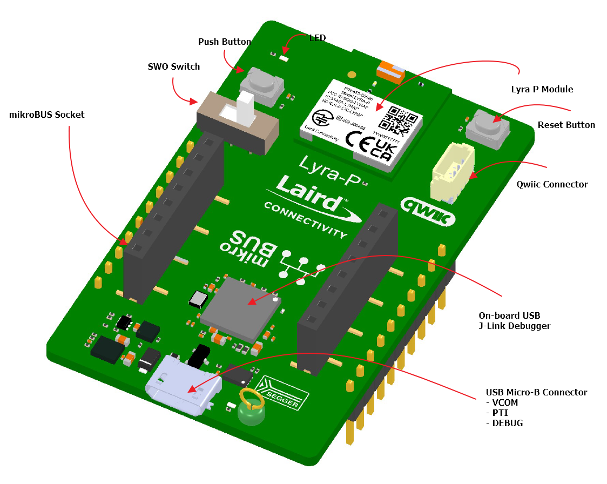

## Simplicity Commander 

Simplicity Commander is an integrated to Simplicity Studio utility, which is used to generate keys, create signed images and load the firmware. The utility executable after the Simplicity Studio is installed can be found in the following location: *C:\SiliconLabs\SimplicityStudio\v5\developer\adapter_packs\commander*

Please add the Simplicity Commander utility to the *path* environment variable on your system to be able to call the utility by name and without specifying the full path location.     

# Private and Public keys generation

The pair of private and public keys are used for firmware authentication based on asymmetric key cryptography. A private key creates a digital signature and public key verifies the signature. A private key is kept secrete and only used to sign the application firmware upgrade image. The signing of the application image is done outside of the SoC. A public key is loaded to the chip NVM during the provisioning process and used for firmware image verification during upgrade and optionally on each system boot.              

Each chip is loaded with two pairs of private and public keys:

- [ ] **Silicon Labs keys** - a private key is stored securely at Silicon Labs, and a public key is provisioned during chip manufacturing. The pair is used to sign and verify *First Stage Bootloader*. 
- [ ] **Final product keys** - a private key is kept by the product manufacture, and a public key is stored into the device by the product manufacture. The pair is used for signing the *Second Stage Bootloader*, *Apploader*, and *Application Firmware Image*s.

The **final product public keys** can be store in two different locations. The first location is an OTP that is accessible only during the *Root Mode* by the *First Stage Bootloader Checker* or the *First Stage Bootloader*. This OTP key storage provides a true Chain-of-Trust through each stage of the device boot. The second location is a *Flash location* that is used by the *Second Stage Bootloader*, the *Apploader* and the *Application Firmware Image*s during User Mode. Some customers may choose to only store their **final product public keys** in *Flash*, avoiding the finality of burning the key in OTP. This is referred to as a *Secure Upgrade* solution. However, note that changes to the *Second Stage Bootloader* can erase the **final product public keys** introducing security implications and mitigations that need to be considered.

To generate **final product public keys**, perform signing operations for development purposes to evaluate or test secure boot or secure updates please use the command below, the ECDSA-P256 keys will be stored on your PC:

​	*commander gbl keygen –-type ecc-p256 –-outfile signing-key* 

The following describes three different files that were generated by the command above:

- [ ] <u>**signing-key-tokens.txt**</u>  - file is used by *commander* to program devices during manufacturing. The tokens are generated from the specific **private  keys**, so there is no issue with outsiders using these public tokens to generate malware. However, these tokens are used by the chip to validate signed images for *Second Stage Bootloader*, *Apploader* and *Application firmware* images received in the future. The key tokens come in an X,Y pair.
- [ ] **<u>signing-key</u>** - file is in a *Privacy Enhanced Mail (PEM)* format. This is common for certificates in Web servers and was used for storing the **private keys**. This cannot be discovered by other users. If others gain access to the **private key**, they could generate images that the device would validate using the **public keys** generated by this **private key**. The **private key** should be securely stored. 
- [ ] **<u>signing-key.pub</u>** - file contains the **public key** that can be used to verify that the *GBL* files were generated by the correct **private key**. If you were to verify the OTA upgrade on another platform, like a gateway or smartphone app, they would likely consume this PEM-encoded **public key** file.

**Note**: Hardware Security Module (HSM) is recommended for key generation in production environment, storage, and image signing. HSM provides with strong protection of sensitive data. According to the instructions from the HSM vendor, have it generate an ECDSA-P256 key pair and export the public key in PEM format to the file **signing-key.pub**. Then use Simplicity Studio **commander** to convert the key to token format, suitable for writing to the EFR32BG22 device using the following command:

​	*commander gbl keyconvert --type ecc-p256 signing-key.pub --outfile signing-key-tokens.txt*

# Secure Boot Second Stage Bootloader, Apploader, Application 

The *First Stage Bootloader* is flashed into the device by Silicon Labs at the factory, the *Second Stage Bootloader* has to be generated and flashed by the user. The user can select from many different configuration options to best match the product, memory and security requirements of their designs.
For the Lyra devices, it is flexible because it has 512k of on chip flash memory. This space allows to use a proven *Apploader* provided by Silicon Labs. The *Apploader* is a separate application that is initiated when an OTA is started. Alternatively customers could choose to integrate the OTA functionality into their application (i.e. no *Apploader*) to upload a new firmware image into the second half of the available flash. Typically *Apploader* is chosen when there isn’t sufficient on-chip space to store a second copy of the application. That is, it provides space optimization. However, it can also make the Application simpler because it offloads the OTA upgrade functions.

**Note**: After connecting the Lyra DVK to the PC using micro-USB cable, launch Simplicity studio and make sure the latest Secure Firmware Versions is used. The latest version at the time of writing this document is **1.2.7** as shown:   

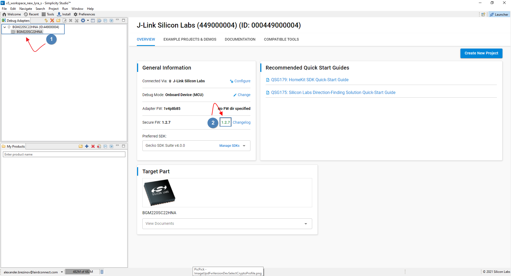

## Import Storage Bootloader Template

From the Examples Projects & Demos tab import the Internal **Storage Bootloader (single image on 512kB device)** by clicking **Create** button. This is *Second Stage Bootloader*.

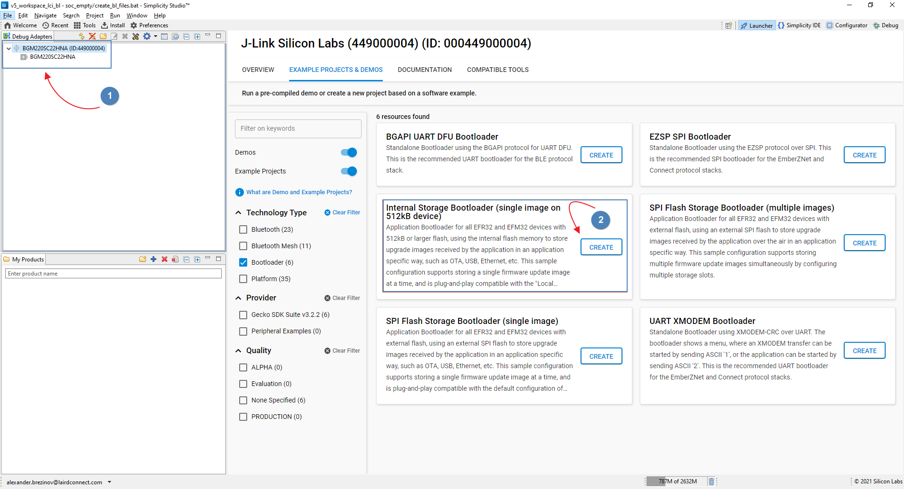

## Enable Security options 

In the **Plugins** tab select **Bootloader Core** plugin and check two options: **“Require signed firmware upgrade files”** and **“Enable Secure Boot”**. The two selected options are instructing the *Second Stage Bootloader* to verify the signatures of *Apploader* and *Application firmware* images, but this does not enable secure boot of the *Second Stage Bootloader* itself. This is done by *First Stage Bootloader* and the configuration is discuss later in this document.

Once the options are checked, save the changes and click **[Generate]**. Upon completion of the generation process, **Build the project**. The executables for the bootloader are located under **"GNU ARM v10.2.1 - Default"** folder once the build is completed.     

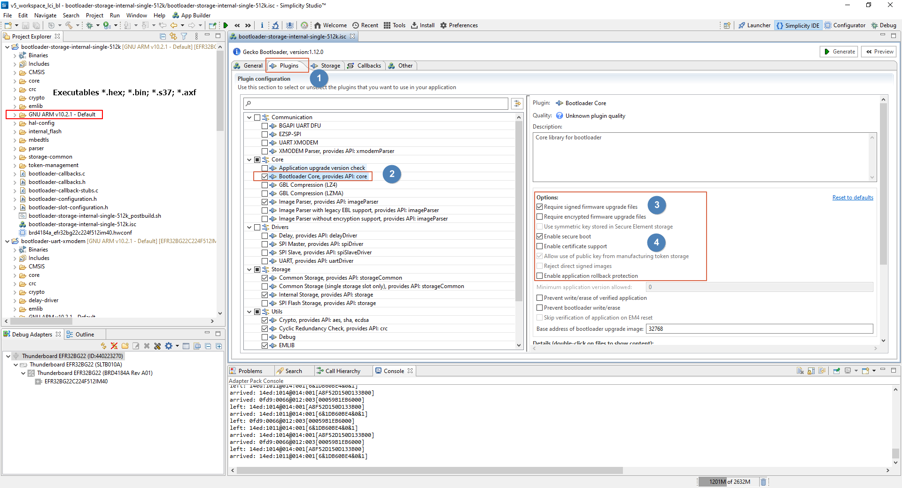

## Generate signed bootloader image using private key

Use the generated in the previous steps **private key** file **signing-key** and **Second Stage Bootloader** executable **bootloader-storage-internal-single-512k.s37** to generate the signed version of the **Second Stage Bootloader** image. The output file, for example can be called: **bootloader-storage-internal-single-512k-signed.s37**. Issue the command below to generate the signed version of the **Second Stage Bootloader**:

​	*commander convert bootloader-storage-internal-single-512k.s37 –-secureboot –-keyfile signing-key –-outfile bootloader-storage-internal-single-512k-	signed.s37*

**Note:** to use the command as shown above place the unsigned version of the **Second Stage Bootloader** executable and private key **signing-key** in the same folder, in addition, the command "*commander*" can be run from the same folder if was added to the *path* environment variable.

## Generate signed Apploader and Application images using private key 

Simplicity studio template such as: **soc-empty** includes a script **create_bl_files.bat/sh** , which generates bootloader files including signed images for **Apploader** and **Application** firmware. The script once is run creates a folder with name **output_gbl**, where the signed images are resided. In order to generate the signed images for **Apploader** and **Application** firmware the **private key** file **signing-key** should be copied to the root folder of the project. The **private key** should be placed in the same folder as the **create_bl_files.bat/sh** script and the name of the **private key** file should be changed to **app-sign-key.pem**. 

To run the script open command prompt on windows or bash shell on Linux and browse to the root folder of the project, where the script and **private key** files are resided. Don't forget to change the name of the **private key** to **app-sign-key.pem** before launching the script. Run the script using the command below:

​	*create_bl_files.bat/sh*

The script generates signed files as shown:

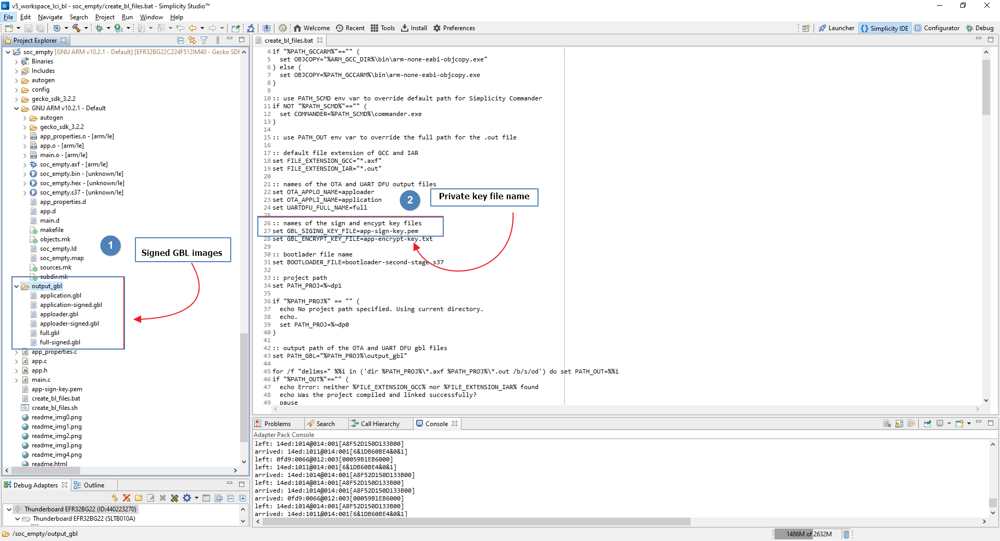

## Storing final product public key into Device

The **final product public key** is used  by **Second Stage Bootloader** to verify Apploder and Application firmware. This key is stored into User Mode location on the chip. It is flashed into topmost page of the main flash and not accessible from the user application. To store the public key on the device use the following command: 

​	*commander flash –-tokengroup znet –-tokenfile signing-key-tokens.txt*

The command above should be launched from the folder where the **signing-key-tokens.txt** file is located.

For strong security, **public keys** need to be protected from accidental or intentional modification. This protection can be accomplished via hardware support, such as storing the keys in an immutable memory such as OTP or a locked flash page, or the key can be crypto-graphically authenticated prior to it being used.

By default, the final product public key is stored in the last page of main flash memory. In order to secure this key, the flash page containing the key must be locked in order to prevent software from being able to modify the key. This flash page protection operation can be performed either in the **Second Stage Bootloader** or in the **Application**.

As an alternative to protecting the final product **public key** via hardware, it can be protected using cryptographic authentication. The method using cryptographic authentication using certificates represents the strongest and most flexible security solution.

## Flashing images to the chip

The following three images are flashed to the chip in addition to the public key: 

- **bootloader-storage-internal-single-512k-signed.s37** - signed **second stage bootloader** 
- **apploader-signed.gbl** - signed apploader GBL for field OTA updated.  
- **application-signed.gbl** - signed application firmware GBL.

Please change to the folder where the images are located and run the commands below:

​	*commander flash bootloader-storage-internal-single-512k-signed.s37*

​	*commander flash apploader-signed.gbl*

​	*commander flash application-signed.gbl*

**Note**: For testing the signed images, use the **EFR Connect** application.  The device loaded with signed application image of the **soc-empty** template project from Simplicity Studio without any modification should be advertising with **"Empty Example"** name. The name **"Empty Example"** should be in the scan list to conclude that the signed images were created correctly. 

# Secure OTA Update    

This section demonstrates how to provide Secure OTA firmware update to the devices in the field. The first steps will modify the existing project so that a change can be detected in the EFR Connect mobile app if the device is successfully updated. The next steps show how to store the signed image to a cloud storage service that your mobile device can access. The final steps will use **EFR Connect** to initiate an OTA update. Examples will show a successful and failed update based on the device receiving an Authentic and Secure new firmware image.

- To generate signed images please modify the device name and change it to: **LCI Example** in the **soc-empty** project, build the project and finally run the script **create_bl_files.bat/sh** using the same  **private key** file **signing-key**
- Copy **output_gbl** folder with the images: **application-signed.gbl** , **application.gbl**,  **apploader.gbl**, **apploader-signed.gbl**, **full.gbl**, and **full-signed.gbl** to **Dropbox** cloud storage. 
- Run **EFR Connect** to perform the OTA procedure, please experiment with partial, full signed images for successful updates and to initiate the failed update use unsigned images as shown:

1. Connect to the device under FOTA ->Click on the three vertical dots->Select **OTA DFU**: 

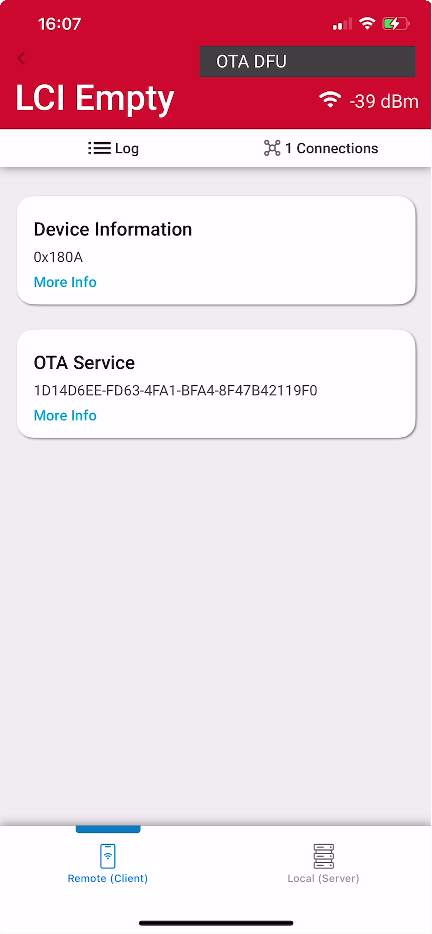 

2. Select **Method**, **Partial** vs. **Full**, for **Partial Method** choose the **Application** image, for **Full Method** select the **Application** and **Apploader** images:

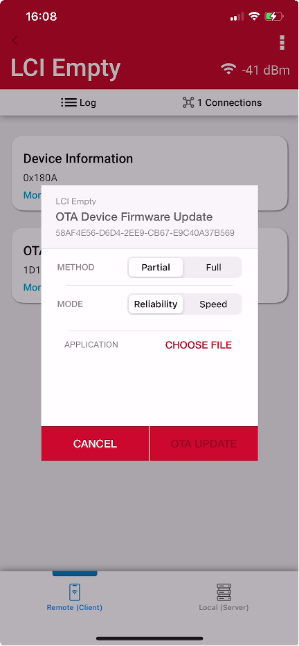   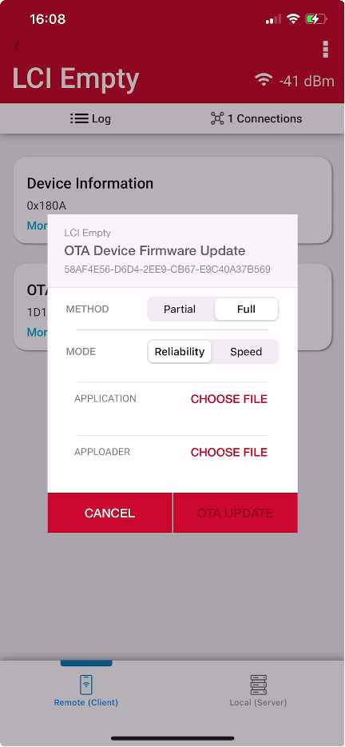

3. Click **Choose File** and select the files from the Cloud Storage Applications (Dropbox): 

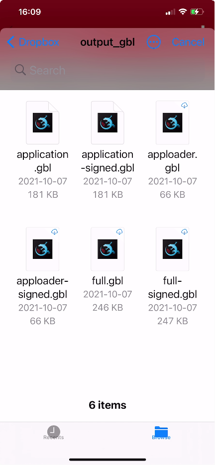  

4. Start the update process by clicking **OTA Update**

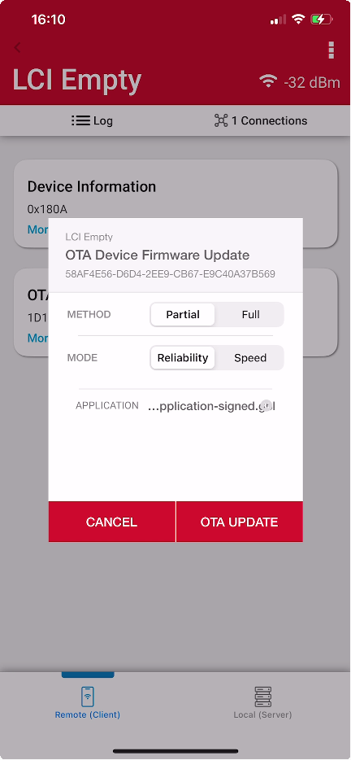   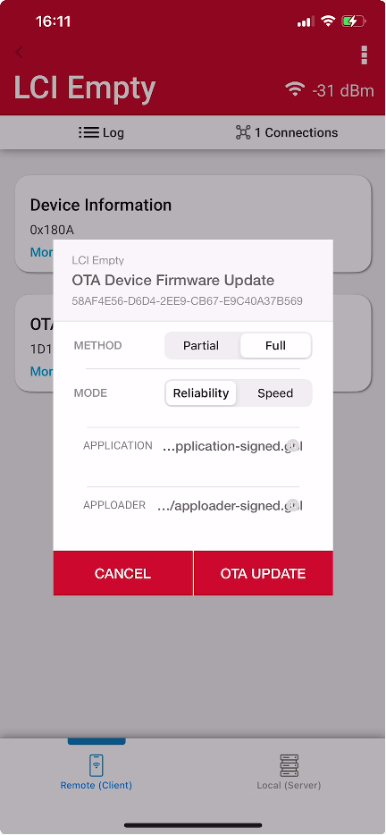  

5. Wait for OTA in progress screen to reach 100%. (Screenshot of the **partial Method** in progress):

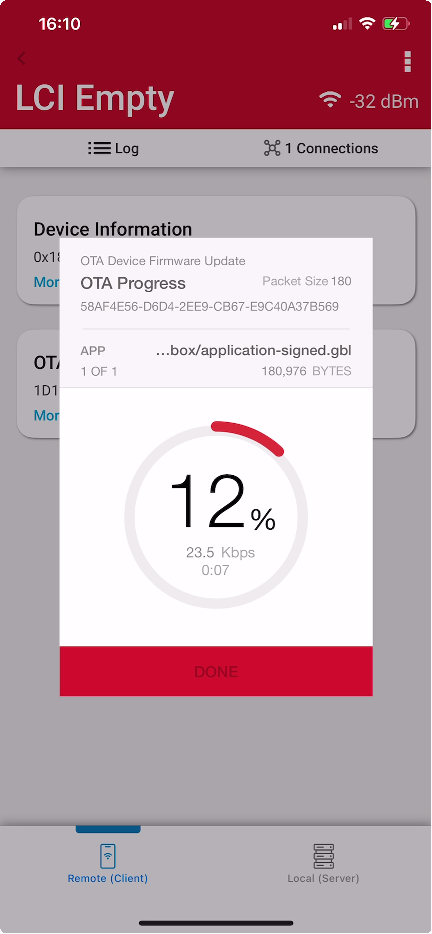    

6. Screenshot indicating the **Full** and **Partial** FOTA procedures are completed successfully:

   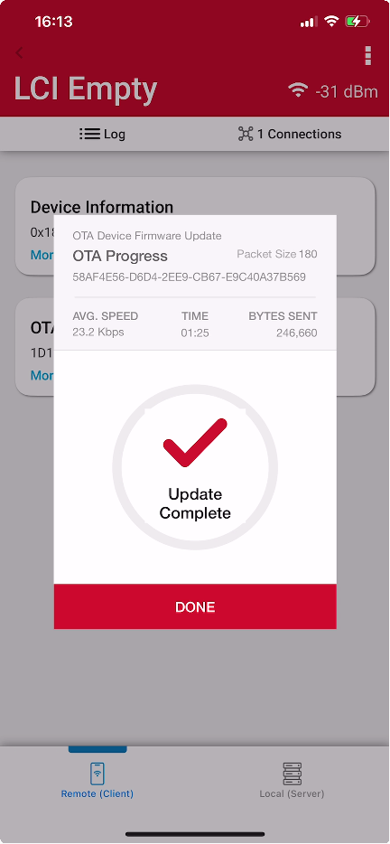 

7. Screenshot indicating the **Error** was simulated by selecting the unsigned Application image from (Dropbox) for **Partial Method**:

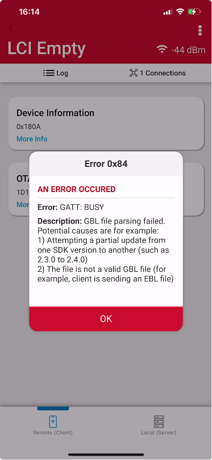    

# Permanently securing the device - Optional

The **First Stage Bootloader Checker** needs the **Silicon Labs public key** to verify the **First Stage Bootloader**. This was already burned into the **ROM** of the device at the Factory.

However, the **First and Second Stage Bootloaders** require the **final product public key** to verify the signature of any signed firmware images. This **public key** can be found in the files **signing-key.pub** and **signing-key-tokens.txt**. This key needs to be flashed into the device by the final product maker.

The commands below will permanently make your device secure. However, it will always require future software updates to be signed by the exact same **private signing-key**. 

You may want to **skip** this step, knowing that you are preventing the device from having a complete **Chain-of-Trust**. Without the key stored in **OTP** memory, the **First Stage Bootloader** will not check the signature of future **Second Stage Bootloader**. This will allow you to reuse the chip with future projects by erasing the full-device along with the **final product public key** stored in flash.

If you choose to complete this section, you will need to use the **same private key** to sign future **Second Stage Bootloader**, **Apploader** and **Application** images.

1. Flashing the **final product public key** to the **OTP**, run the following command, Type "Continue" to confirm, that this step is irrevocable:

   *commander security writekey --sign signing-key.pub --device EFR32BG22C224F512IM40*

2. Enable **First Stage Bootloader** to use **Secure Boot** to authenticate **Second Stage Bootloader**

   1. Open the “Device Configuration”

      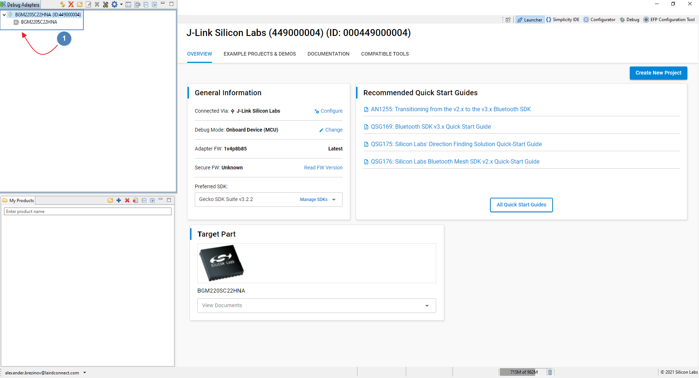

   2. Select the “**Security Settings**” tab, click “**Read from Device**”, and "**Start Provisioning Wizard**" to enable **secure boot** in the **First Stage Bootloader**

      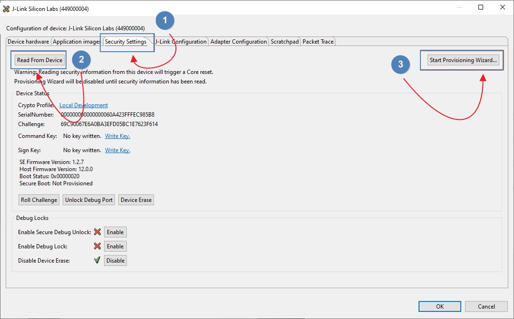

   3. Enable irrevocable write data operation for **OTP** for **public key**. Alternatively, version number and certificate verification flags can be set, click **Next**:

      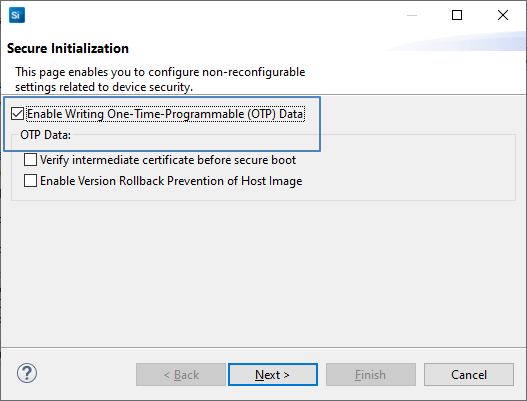  

   4. In the “**Security Keys**” window you will notice that the **sign key** is already filled in, click **Next**:

      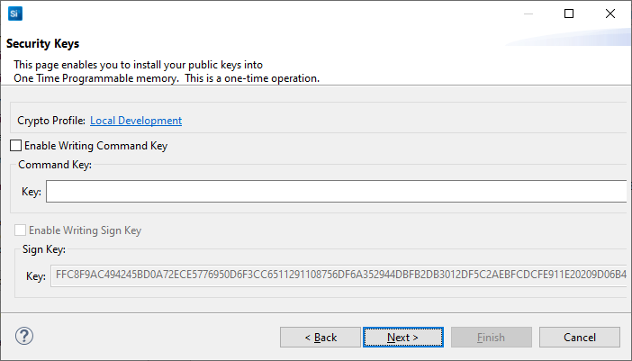

   5. Use the default settings in the “**Secure Locks**” dialog:

      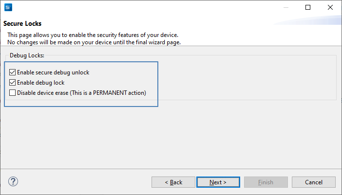

   6. Review the summary, click “**Provision**” to continue, and then click “Yes” to complete changing the security settings:

      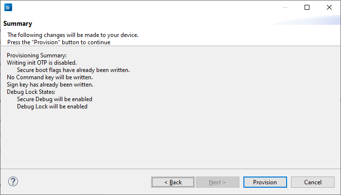

   7. At the “Security Settings” tab, you can verify success by reading “Secure Boot: Enabled” after completing the above steps:

      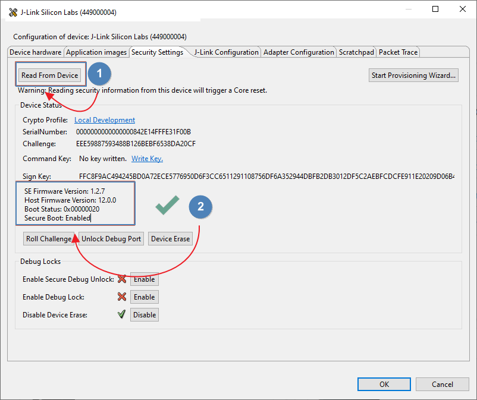

# Keys and precompiled binaries

The precompiled, and ready to be used signed and unsigned binaries of the **Bootloader**, unsigned images of **Apploader**, **Application** and **GBL** files are included in the [bin](bin/) folder of the repository. The files can be programmed to the device using Simplicity Studio "**commander**" utility as was described above.  In addition, the script for creating the GBL files targeting both platforms Linux and Windows can be found in the [scripts](scripts/) folder. The **public and private keys**, that were used for signing the images are included in the [keys](keys/) folder.   

**Note: the keys are provided for testing purposes and can't be used in any final product.**  

The following list describes the included keys, scripts, and bin folders files:

- [ ] [**signing-key-tokens.txt**](keys/signing-key-tokens.txt) - file is used by *commander* to program devices during manufacturing. The tokens are generated from the specific **private  keys**, so there is no issue with outsiders using these public tokens to generate malware. However, these tokens are used by the chip to validate signed images for *Second Stage Bootloader*, *Apploader* and *Application firmware* images received in the future. The key tokens come in an X,Y pair.
- [ ] **<u>[signing-key](keys/signing-key)</u>** - file is in a *Privacy Enhanced Mail (PEM)* format. This is common for certificates in Web servers and was used for storing the **private keys**. This cannot be discovered by other users. If others gain access to the **private key**, they could generate images that the device would validate using the **public keys** generated by this **private key**. The **private key** should be securely stored. This file was used to sign bootloader image.
- [ ] **<u>[signing-key.pub](keys/signing-key.pub)</u>** - file contains the **public key** that can be used to verify that the *GBL* files were generated by the correct **private key**. If you were to verify the OTA upgrade on another platform, like a gateway or smartphone app, they would likely consume this PEM-encoded **public key** file.
- [ ] **[app-sign-key.pem](keys/app-sign-key.pem)** - this file is identical to **signing-key** file and was used to sign the **Apploader** and **Application** images. 
- [ ] **[create_bl_files.sh](scripts/create_bl_files.sh)** - script is targeting Linux platform and included in **soc-empty** template. It creates GBL signed and unsigned files. 
- [ ] **[create_bl_files.bat](scripts/create_bl_files.bat)** - script is targeting Windows platform and included in **soc-empty** template. It creates GBL signed and unsigned files. 
- [ ] **[application.gbl](bin/application.gbl)** - unsigned GBL file for **soc-empty** application.  
- [ ] **[application-signed.gbl](bin/application-signed.gbl)** - signed GBL file for **soc-empty** application. 
- [ ] **[apploader.gbl](bin/apploader.gbl)** - unsigned GBL file for Apploader.
- [ ] **[apploader-signed.gbl](bin/apploader-signed.gbl)** - signed GBL file for Apploader.
- [ ] **[full.gbl](bin/full.gbl)** - unsigned GBL file for Apploader and  soc-empty Application.
- [ ] **[full-signed.gbl](bin/full-signed.gbl)** - signed GBL file for Apploader and  soc-empty Application.
- [ ] **[bootloader-storage-internal-single-512k.axf/bin/hex/s37/-crc.s37](bin/)** - **second stage bootloader** unsigned image in different formats including CRC.
- [ ] **[bootloader-storage-internal-single-512k-signed.s37](bin/bootloader-storage-internal-single-512k-signed.s37)** - **second stage bootloader** signed **S-record** image.
- [ ] **[soc-empty.axf/bin/hex/s37](bin/)** - **soc-empty** unsigned image in different formats.

### To flash the files using Simplicity Studio "**commander**" utility please follow the steps below: 

- ##### Store the public key in the main flash:

  ###### commander flash –-tokengroup znet –-tokenfile signing-key-tokens.txt

- ##### Load the second stage bootloader to flash:

  ###### commander flash bootloader-storage-internal-single-512k-signed.s37

- ##### Flash the chip with Apploader image:

  ###### commander flash apploader-signed.gbl

- ##### Burn the Application image to the main flash:

  ###### commander flash application-signed.gbl

