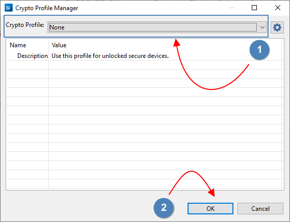

# Bluetooth low energy Environmental Sensing central client sample

## Introduction 

This example implements the central client part of the environmental sensing service. It is capable to establish connection with peripheral server devices supporting environmental sensing service in the vicinity and read the humidity and temperature. The device is a Bluetooth low energy GATT client, which reads the sensor's data periodically.

This code example uses the [si7021_peripheral_server](../si7021_peripheral_server) sample to access the si7021 sensor. 

## Gecko SDK version

v4.0.0

## Hardware requirement

- 2x [Lyra DVK/s](https://www.lairdconnect.com/wireless-modules/bluetooth-modules)
- [A MikroE Temp&Hum 7 Click board](https://www.mikroe.com/temp-hum-7-click)

## Connections requirement

This setup requires two Lyra DVK/s boards, one for the central client and the second for peripheral server. The Temp&Hum 7 Click board can just be "attached" into the mikroBUS connector on the Lyra DVK acting as peripheral server. The steps are described in [si7021_peripheral_server](https://github.com/LairdCP/BGM220_Firmware_Samples/blob/main/si7021_peripheral_server) sample [README](https://github.com/LairdCP/BGM220_Firmware_Samples/blob/main/si7021_peripheral_server/README.md). The power LED [PWR] on the Temp&Hum 7 Click board should be solid green after applying the power. Both Lyra DVK/s can be connected to the PC USB slot using a microUSB cable. The USB connection is used as a 5V power source for the  hardware setup, as well as it support COM port serial interface. The exported COM port number on Windows can be found using [**Device Manager**] under [**Ports (COM & LPT)**] with device name [**JLink CDC UART Port (COMYY)**]. Once the COM port was identified you can use a terminal emulator program of your choice to establish serial connection with both devices.         

## Software requirement

This application is implemented using Simplicity Studio v5. The SOC-Empty project template is used as a starting point and additional functions to support central client scanning and GATT environmental sensing service are added to the provided template. 

1. Select the Lyra DVK Board from the "Debug Adapters" on the left, establish connection with the IDE by pushing **Start** button.

   

2. Configure on-board J-Link debugger, if this is a new workspace, by pressing **Configure**, otherwise skip this step and continue with step **#11**:   

   

3.  Set target device by changing to **Device hardware** tab and typing the device name in the **Target path** [for Lyra S use **BGM220SC22HNA**, for Lyra P use **BGM220PC22HNA**], Press **OK** to complete the operation.   

   

4. Make sure the latest secure FW version is used by reading it.

   

5. Select, **Yes** for the Warning dialog to Continue.

   

6. Update the Secure FW by clicking the Update button, the update button is prompted if the firmware on the SoC is behind the latest version in IDE.

     

7. Select Crypto profile

    

8. Allow secure element firmware update to continue by clicking **Yes**

   

9. Validate the secure element firmware update. The latest version should be printed as shown.

      

10. Select SDK for the project.

   

11. Create a **Bluetooth - SoC Empty** project for the "Lyra DVK Board" using Simplicity Studio v5. Use the default project settings. 

   

12.  Assign project name, example: *si7021_central_client* and select "*Finish*". Once the project is create in the Simplicity Studio workspace, please follow the instruction's session [**Testing the SOC-Empty Application**] in the *readme.html* file of the project to test the firmware. After testing the firmware and if is running as expected we can start with additional modifications to support si7021 sensor.  

   

13. Open the .slcp file in the project, change to "**Software Components**" tab  and extend "**Advanced Configurators**"  by clicking the arrow, Select [**Bluetooth GATT configurator**] from [**Advanced Configurators**] and click "**Open**" button in the right top corner

   

14. Assign device name -  1) select [**Device Name**] from [**Generic Access**] service; 2) Set device name; 3) Set device name size; 4) Save the changes to *.btconf file. BT configurations file can be closed at this point.

   

15. Install [**IO Stream USART**] from [**Services**].  1) Select the [**IO Stream USART**] and click "**Install**" button in the top right corner. 2) Assign "**vcom**" to instance name. 3) Click "**Done**" to complete the installation process of IO stream USART component. 

   
   
16. Configure **VCOM**.

   

17. Select **USART1**.

   

18. Configure **USART1**, assign GPIO/s.

   

19. Install [**Log**] from [**Application**] -> [**Utility**] and click "**Install**" button in the top right corner

   

20. Install [**Tiny printf**] from [**Third Party**] and click "**Install**" button in the top right corner

   

21. Install [**PowerControl**] from [**Bluetooth**] -> [**Feature**]. Click "**Install**" button in the top right corner to complete the installation.

   

22. Delete the original **app.c** source file from early created **soc-empty** template and add to the project the ***[app.c](https://github.com/LairdCP/BGM220_Firmware_Samples/blob/main/si7021_central_client/src/app.c)*** and [***lci_si7021_app.c***](https://github.com/LairdCP/BGM220_Firmware_Samples/blob/main/si7021_central_client/src/lci_si7021_app.c) source files from this [repository](https://github.com/LairdCP/BGM220_Firmware_Samples/tree/main/si7021_central_client/src).

   
   
23. Build the project. The build process should finish with zero errors and zero warnings. Once is completed, please use debug sessions from Simplicity Studio or SWD to load the firmware executable to the Lyra DVK and at this point we can start with testing the firmware. In addition, if you haven't done it already, please prepare the second Lyra DVK with si7021 sensor attached to MikroBus and load the peripheral server firmware [binary](https://github.com/LairdCP/BGM220_Firmware_Samples/blob/main/si7021_peripheral_server/bin/si7021_peripheral_server.bin).     

## How central client accesses the sensor's humidity and temperature data

The firmware is based on the Bluetooth Low Energy **soc-empty** template from Simplicity Studio. The example was configured to support the GATT client, GATT server, advertising, scanning and connection mechanisms. However, to support Environmental Sensing service several additional configurations were added to the template. 

The first two changes were assigning unique device name to perform FOTA, and identifying  the Environmental Sensing service UUID `181A` in advertising data by parsing the scan report information. This central device will try to establish connection only with peripheral devices which are including the Environmental Sensing service UUID in their advertising data. In addition, the device performs GATT client procedures to discover services and characteristics. si7021 central device discovers  Environmental Sensing service `181A` and two characteristics with Read properties: `2A6E`  for temperature and `2A6F` for humidity. The temperature and humidity characteristics are 2 bytes. The temperature values are in degree Celsius and relative humidity values are expressed as percentage. Upon successful completion of the discovery process the temperature and humidity values are requested from the peripheral server via ***sl_bt_gatt_read_characteristic_value()***  API function. The application gets ***sl_bt_evt_gatt_characteristic_value_id*** notification when the data is ready to be read.   

To interact with the sensor please follow the below steps:

1. Prepare, load the firmware and run the si7021 peripheral server device as described [here](../si7021_peripheral_server#readme) 

3. Attach the Lyra DVK to PC USB slot with si7021 central client firmware loaded. The device connects automatically to the si7021 peripheral server and starts outputting sensor data to the connected virtual com as shown in the TeraTerm logs below.  

5. Try to change the temperature and humidity by touching the sensor on the board and check the values. Try to corollate the serial data outputted by central client with the data generated by peripheral sever. The humidity and temperature which was read within the same reading cycle on the central client side should match the data outputted on the peripheral server side.      

TeraTerm logs from the virtual COM port:

## Execute firmware with project binaries

The precompiled and ready to be used binaries of the bootloader [[bootloader-uart-bgapi.bin](bin/bootloader-uart-bgapi.bin)] and application [[si7021_central_client.bin](bin/si7021_central_client.bin)] are included in the [bin](bin) folder of the repository. The files can be programmed using Simplicity Studio Flash Programmer tool, Simplicity Commander application or [Segger J-Link](https://www.segger.com/products/debug-probes/j-link/). Remember to flash the bootloader at least once. 

To flash the files using [Segger J-Link](https://www.segger.com/products/debug-probes/j-link/), please follow the steps below, issue target reset "***r***" if the command is completed with errors:   

1. *erase 0x6000 0x80000* - to erase the application partition 

2. *erase 0 0x6000* - to erase the bootloader partition 

3. *loadfile [si7021_central_client.bin](bin/si7021_central_client.bin) 0x6000* - to program the application partition 

4. *loadfile [bootloader-uart-bgapi.bin](bin/bootloader-uart-bgapi.bin) 0* - to program the bootloader partition

 

